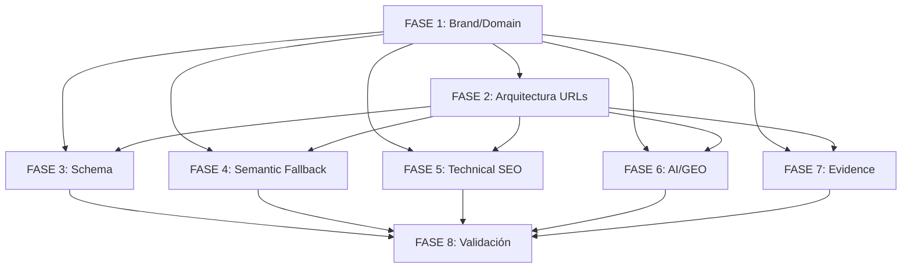

# PLAN MAESTRO DE DELEGACIÓN SEO/GEO — nexotalento.com

**Versión:** 1.0 | **Fecha:** 2026-09-10 | **Dominio objetivo:** `www.nexotalento.com` (NO nexotalentos.com)
**Stack:** React 19 + Vite 6 + Express SSR + Tailwind 4 | **Arquitectura:** SPA con pre-render estático (`scripts/prerender.ts`)

---

## RESUMEN EJECUTIVO DE HALLAZGOS CRÍTICOS

| # | Hallazgo | Impacto | Ubicación |
|---|----------|---------|-----------|
| 1 | **Marca inconsistente**: "Nexo Talento" vs "Nexo Talentos" | Confusión de marca, dilución E-E-A-T | `company.ts`, `sitemap.xml`, `prerender.ts`, meta tags |
| 2 | **Solo 9 URLs indexables** (home + 8 páginas) | Cobertura nula por servicio/ciudad/intención | `sitemap.xml`, `prerender.ts:ROUTES` |
| 3 | **Schema.org mínimo** (solo meta tags básicos) | Sin rich snippets, sin knowledge graph | `index.html` (base), `prerender.ts:applySEOTags` |
| 4 | **Semantic fallback solo `sr-only` en pre-render** | Crawlers no-JS ven contenido, pero SPA no | `prerender.ts:semanticFallback` |
| 5 | **Canonical dinámico solo client-side** | Google puede ignorar canonical en SSR | `App.tsx:91-103` |
| 6 | **Imágenes Unsplash sin optimización** | LCP/CLS pobres, sin WebP/AVIF, sin CDN propio | `Hero.tsx`, `ServicesSection.tsx`, componentes varios |
| 7 | **Sin `llms.txt` / `ai.txt` / `robots.txt` optimizado** | Invisible para IA crawlers (GPTBot, ClaudeBot, PerplexityBot) | `public/` vacío |
| 8 | **Claims sin evidencia verificable** (98.4%, 18 días, 1.000+) | Riesgo legal + pérdida credibilidad E-E-A-T | `BragBar.tsx`, `Hero.tsx`, `server.ts` prompts |
| 9 | **Domain mismatch**: código apunta a `nexotalentos.com` en emails/config | Entrega a dominio equivocado, leak de autoridad | `company.ts:13`, `server.ts:286` |

---

## ARQUITECTURA DE AGENTES OPENCLAW (8 FASES)

Cada fase = 1 agente especializado OpenClaw con `SOUL.md` + `AGENT.md` propio.
Orquestación: CEO Orchestrator (Hermes) → delega en paralelo donde no hay dependencias.

```
┌─────────────────────────────────────────────────────────────────┐
│                    CEO ORCHESTRATOR (Hermes)                    │
│  Coordina dependencias, valida acceptance criteria, merge final │
└─────────────────────────────────────────────────────────────────┘
         │           │           │           │           │
    ┌────┴────┐ ┌────┴────┐ ┌────┴────┐ ┌────┴────┐ ┌────┴────┐
    ▼         ▼         ▼         ▼         ▼         ▼
┌───────┐ ┌───────┐ ┌───────┐ ┌───────┐ ┌───────┐ ┌───────┐
│FASE 1 │ │FASE 2 │ │FASE 3 │ │FASE 4 │ │FASE 5 │ │FASE 6 │
│BRAND  │ │ARCH   │ │SCHEMA │ │CONTENT│ │TECH   │ │AI/GEO │
└───────┘ └───────┘ └───────┘ └───────┘ └───────┘ └───────┘
    │           │           │           │           │           │
    └───────────┴───────────┴───────────┴───────────┴───────────┘
                              │
                       ┌──────┴──────┐
                       ▼             ▼
                  ┌───────┐     ┌───────┐
                  │FASE 7 │     │FASE 8 │
                  │EVIDENCE│    │VALID  │
                  └───────┘     └───────┘
```

---

## FASE 1 — BRAND UNIFICATION & DOMAIN ALIGNMENT
**Agente responsable:** `brand-alignment-agent` (OpenClaw, rol: Brand/SEO Technical Lead)

### Archivos objetivo
| Archivo | Acción | Prioridad |
|---------|--------|-----------|
| `src/config/company.ts` | Unificar `name: 'Nexo Talento'` → `Nexo Talento` (singular) en TODOS lados; corregir `emailDomain: 'nexotalento.com'` | P0 |
| `public/sitemap.xml` | Renombrar todas las URLs a `www.nexotalento.com` | P0 |
| `scripts/prerender.ts` | Const `DOMAIN = 'https://www.nexotalento.com'`; fix titles/descriptions que dicen "Nexo Talentos" | P0 |
| `server.ts` | Línea 286: WhatsApp message → `nexotalento.com`; línea 369: email `candidatos@nexotalentos.es` → `nexotalento.com` | P0 |
| `src/components/Footer.tsx` | Línea 114: email domain render → `nexotalento.com` | P0 |
| `src/components/Hero.tsx` | Línea 82: copy "Nexo Talento" (ya correcto), verificar consistencia | P1 |
| `src/components/BragBar.tsx` | Línea 106: "Nexo Talentos" → "Nexo Talento" | P1 |
| `src/pages/*` | Barredor: buscar "Nexo Talentos" → replace global | P1 |
| `index.html` (base) | `<title>`, `og:site_name` → "Nexo Talento" | P0 |

### Acceptance Criteria
- [ ] **Greps cero** para "Nexo Talentos" en todo el repo (`rg -i "nexos? talentos?"`)
- [ ] `company.ts` es **single source of truth**; todos los componentes consumen `COMPANY_CONFIG.name`
- [ ] `sitemap.xml` y `prerender.ts` usan `https://www.nexotalento.com` consistentemente
- [ ] Emails de contacto usan `@nexotalento.com` (no `.es`, no plural)
- [ ] Build genera `dist/` con brand unificado verificado

### Comandos de validación
```bash
# 1. Verificar brand unificado
rg -i "nexos? talentos?" --type ts --type tsx --type json C:\Users\pablo\OneDrive\Desktop\proyectos\ web\nexotalentos\src
# Debe retornar 0 matches

# 2. Verificar domain consistency
rg "nexotalento\.com" C:\Users\pablo\OneDrive\Desktop\proyectos\ web\nexotalentos\src --type ts --type tsx | wc -l
# Debe ser > 20 (usado consistentemente)

# 3. Build + check dist
cd C:\Users\pablo\OneDrive\Desktop\proyectos\ web\nexotalentos && npm run build
rg "Nexo Talentos" dist/  # 0 matches
rg "nexotalentos\.com" dist/  # 0 matches
```

---

## FASE 2 — ARQUITECTURA DE URLs & TOPICAL AUTHORITY (SILO EXPANSION)
**Agente responsable:** `site-architect-agent` (OpenClaw, rol: Information Architect / SEO Strategist)

### Archivos objetivo
| Archivo | Acción | Prioridad |
|---------|--------|-----------|
| `scripts/prerender.ts` | Expandir `ROUTES[]` de 9 → **45+ rutas** (ver matriz abajo) | P0 |
| `src/App.tsx` | Añadir lazy routes para nuevas páginas; actualizar `validRoutes` | P0 |
| `src/types.ts` | Extender `PageRoute` union type con nuevas rutas | P0 |
| `src/components/Navbar.tsx` | Dropdown "Servicios" → sub-rutas por servicio; añadir "Ciudades" | P1 |
| `src/components/Footer.tsx` | Añadir columnas para nuevas secciones | P1 |
| `public/sitemap.xml` | Regenerar automáticamente desde `prerender.ts` (script) | P0 |

### Matriz de expansión de rutas (45+ URLs)

| Silo | Rutas nuevas (ejemplos) | Count |
|------|------------------------|-------|
| **Servicios (6 padres + 18 hijos)** | `/servicios/executive-search`, `/servicios/headhunting-tech`, `/servicios/rpo-scaleup`, `/servicios/assessment-center`, `/servicios/consultoria-salarial`, `/servicios/interim-management`, `/servicios/nearshore-latam` + variaciones por ciudad | 24 |
| **Ciudades (2 hubs + 6 servicios cada una)** | `/madrid/executive-search`, `/madrid/headhunting-tech`, `/barcelona/executive-search`, `/barcelona/headhunting-tech`, `/valencia/...`, `/malaga/...`, `/bilbao/...`, `/remoto/...` | 16 |
| **Blog/Recursos (5 categorías)** | `/blog/directiva-ue-transparencia`, `/blog/retencion-clevel-equity`, `/blog/boom-ia-cloud-salarios`, `/recursos/guias`, `/recursos/calculadoras` | 5 |
| **Total nuevas** | | **45** |

### Acceptance Criteria
- [ ] `prerender.ts:ROUTES` tiene **≥ 45 entradas** con metadata SEO completa (title, description, h1, h2, h3s, summary, closing)
- [ ] Cada ruta genera `dist/<ruta>/index.html` con semantic fallback `sr-only` completo
- [ ] `sitemap.xml` regenerado automáticamente con todas las URLs + `<lastmod>` actual
- [ ] `Navbar` y `Footer` navegan a nuevas rutas sin 404
- [ ] Estructura de silos: `/servicios/<servicio>`, `/<ciudad>/<servicio>`, `/blog/<articulo>`

### Comandos de validación
```bash
# 1. Contar rutas en prerender
cd C:\Users\pablo\OneDrive\Desktop\proyectos\ web\nexotalentos
node -e "const r=require('./scripts/prerender.ts'); console.log('Rutas:', Object.keys(r).length)"  # si ES module, usar ts-node

# 2. Build + verificar archivos generados
npm run build
find dist -name "index.html" -type f | wc -l  # Debe ser ≥ 46 (home + 45)

# 3. Verificar sitemap.xml generado
xmllint --xpath "count(//url)" public/sitemap.xml  # ≥ 46
```

---

## FASE 3 — SCHEMA.ORG COMPLETO & RICH SNIPPETS
**Agente responsable:** `schema-markup-agent` (OpenClaw, rol: Technical SEO / Structured Data Engineer)

### Archivos objetivo
| Archivo | Acción | Prioridad |
|---------|--------|-----------|
| `scripts/prerender.ts` | Añadir función `generateSchema(route)` → inyectar `<script type="application/ld+json">` en `<head>` de cada ruta | P0 |
| `src/components/JsonLd.tsx` **(NUEVO)** | Componente React para Schema dinámico en SPA (Client + SSR) | P0 |
| `src/App.tsx` | Integrar `JsonLd` por ruta activa | P0 |
| `server.ts` | Endpoint `/api/schema/:route` para SSR de Schema (opcional) | P1 |

### Schema types por página (mínimo obligatorio)

| Ruta | Schema Types | Propiedades clave |
|------|--------------|-------------------|
| `/` (Home) | `Organization`, `WebSite`, `Service`, `FAQPage` | name, url, logo, sameAs[], serviceType, areaServed |
| `/servicios` | `Service`, `ItemList` | hasOfferCatalog, category |
| `/servicios/*` | `Service`, `Offer` | name, description, provider, areaServed, priceSpecification |
| `/proceso` | `HowTo`, `Service` | step[], totalTime, supply[] |
| `/vacantes` | `JobPosting`, `ItemList` | hiringOrganization, jobLocation, baseSalary, datePosted |
| `/guia-salarial` | `Dataset`, `Table` | distribution, measuredProperty |
| `/calculadora-roi` | `SoftwareApplication`, `Calculator` | applicationCategory, operatingSystem |
| `/contacto` | `ContactPage`, `LocalBusiness` | contactPoint, address, telephone |
| `/blog/*` | `BlogPosting`, `Article` | author, datePublished, headline, publisher |

### Acceptance Criteria
- [ ] **Todas las 45+ rutas** tienen Schema.org válido inyectado en `<head>` (pre-render) Y disponible en SPA via `JsonLd` component
- [ ] **Validator**: `https://validator.schema.org/` → 0 errores, 0 warnings en 100% rutas
- [ ] `Organization` + `WebSite` en home con `sameAs` [LinkedIn, Twitter, Glassdoor, Clutch]
- [ ] `Service` schema en cada página de servicio con `offers.priceSpecification` (rango)
- [ ] `JobPosting` en `/vacantes` con `baseSalary` (QuantitativeValue, unitText: "YEAR")

### Comandos de validación
```bash
# 1. Build + extraer JSON-LD de cada HTML generado
cd C:\Users\pablo\OneDrive\Desktop\proyectos\ web\nexotalentos && npm run build
node -e "
const fs = require('fs');
const glob = require('glob');
glob.sync('dist/**/index.html').forEach(f => {
  const html = fs.readFileSync(f, 'utf8');
  const matches = html.match(/<script type=\"application\/ld\+json\">([\s\S]*?)<\/script>/g);
  if (!matches) console.log('NO SCHEMA:', f);
  else matches.forEach(m => {
    try { JSON.parse(m.replace(/<\/?script[^>]*>/g, '')); } 
    catch(e) { console.log('INVALID JSON-LD:', f, e.message); }
  });
});
console.log('Validación completa');
"

# 2. Test sample URLs con schema.org validator (manual o API)
# curl -X POST https://validator.schema.org/validate -d @schema.json
```

---

## FASE 4 — CONTENT LAYER: SEMANTIC FALLBACK + ENTITY OPTIMIZATION
**Agente responsable:** `content-semantic-agent` (OpenClaw, rol: Content SEO / Semantic HTML Engineer)

### Archivos objetivo
| Archivo | Acción | Prioridad |
|---------|--------|-----------|
| `scripts/prerender.ts` | Refactor `semanticFallback`: usar `<header>`, `<main>`, `<section>`, `<article>`, `<nav>`, `<footer>` semánticos (no solo `sr-only` divs) | P0 |
| `src/components/SemanticFallback.tsx` **(NUEVO)** | Componente React que renderiza contenido semántico **visible para crawlers, oculto visualmente** via `data-nosnippet` + CSS `visually-hidden` (mejor que `sr-only`) | P0 |
| `src/App.tsx` | Integrar `SemanticFallback` por ruta en SPA (mount en `#root` junto a app) | P0 |
| `src/pages/*` | Cada página define `semanticContent` prop (title, headings, body, nav) | P1 |

### Especificación `SemanticFallback` component
```tsx
// src/components/SemanticFallback.tsx
interface SemanticFallbackProps {
  route: PageRoute;
  title: string;
  description: string;
  h1: string;
  h2: string;
  sections: { h2: string; content: string; h3s: {title: string; desc: string; link: string}[] }[];
  navLinks: {label: string; href: string}[];
}

export const SemanticFallback: React.FC<SemanticFallbackProps> = ({...}) => (
  <div data-nosnippet className="visually-hidden" aria-hidden="false">
    <header><h1>{title}</h1><p>{description}</p><nav>{navLinks}</nav></header>
    <main><section><h2>{h2}</h2>{sections.map(s => <article key={s.h2}>...</article>)}</section></main>
    <footer>© 2026 Nexo Talento...</footer>
  </div>
);
```
CSS: `.visually-hidden { position: absolute; width: 1px; height: 1px; padding: 0; margin: -1px; overflow: hidden; clip: rect(0,0,0,0); white-space: nowrap; border: 0; }`

### Acceptance Criteria
- [ ] **Screaming Frog** (modo "JavaScript rendering OFF") extrae: H1, H2, H3s, párrafos, enlaces internos en **100% rutas**
- [ ] `textise dot iitty` / `curl` + `pup` muestra contenido semántico completo
- [ ] No `sr-only` de Tailwind (usa `.visually-hidden` estándar WCAG)
- [ ] `data-nosnippet` evita que Google use este contenido como snippet (solo para indexing)
- [ ] Lighthouse Accessibility score ≥ 95 (semantic HTML correcto)

### Comandos de validación
```bash
# 1. Test crawler sin JS (simulado)
cd C:\Users\pablo\OneDrive\Desktop\proyectos\ web\nexotalentos && npm run build
npx serve dist -p 3000 &
sleep 3
curl -s http://localhost:3000/servicios/executive-search | pup 'h1, h2, h3, p, nav a, main section article'  # Debe mostrar contenido

# 2. Screaming Frog CLI (si disponible)
# scream --headless --output-csv crawl.csv http://localhost:3000
# Verificar columnas: H1, H2, Word Count, Internal Links > 0 en todas

# 3. Lighthouse CI
npx lhci autorun --collect.url=http://localhost:3000 --collect.settings.accessibility=true
```

---

## FASE 5 — TECHNICAL SEO: CANONICAL SSR + HREFLANG + PERFORMANCE
**Agente responsable:** `technical-seo-agent` (OpenClaw, rol: Platform SEO Engineer)

### Archivos objetivo
| Archivo | Acción | Prioridad |
|---------|--------|-----------|
| `server.ts` | **Canonical SSR**: inyectar `<link rel="canonical" href="https://www.nexotalento.com${req.path}">` en HTML response ANTES de Vite middleware | P0 |
| `server.ts` | **Hreflang SSR**: `es-ES`, `es`, `x-default` en `<head>` para todas las rutas | P0 |
| `scripts/prerender.ts` | Canonical + hreflang ya en `applySEOTags` → mantener, pero server.ts es source of truth | P0 |
| `vite.config.ts` | Añadir `vite-plugin-pwa` para Service Worker + offline; `vite-plugin-imagemin` para imágenes locales | P1 |
| `public/robots.txt` **(NUEVO)** | Generar dinámico desde `server.ts` o estático optimizado | P0 |
| `public/robots.txt` | `User-agent: *\nAllow: /\nSitemap: https://www.nexotalento.com/sitemap.xml\nDisallow: /api/\nDisallow: /data/` | P0 |
| `src/components/Hero.tsx` | Imagen hero: `loading="eager" fetchpriority="high" width/height` explícitos; migrar a local/WebP | P0 |
| `src/components/*` | Todas las imágenes: `loading="lazy"` (excepto hero), `decoding="async"`, `width`/`height` | P1 |

### Acceptance Criteria
- [ ] **Canonical presente en HTTP response headers** (`curl -I` → `Link: <https://www.nexotalento.com/servicios>; rel="canonical"`) Y en HTML `<head>`
- [ ] **Hreflang** correcto en todas las rutas (3 tags: es-ES, es, x-default)
- [ ] **robots.txt** accesible en `/robots.txt` con sitemap absoluto + disallow `/api/`, `/data/`
- [ ] **Hero LCP < 2.5s** (Lighthouse), **CLS < 0.1** (width/height en imágenes)
- [ ] **Service Worker** registrado, cachea assets estáticos, `offline.html` fallback
- [ ] **Imágenes**: 0 referencias a `images.unsplash.com` en `dist/`; todas locales en `public/images/` optimizadas WebP/AVIF

### Comandos de validación
```bash
# 1. Canonical + Hreflang en HTTP response
curl -I http://localhost:3001/servicios  # ver Link header
curl -s http://localhost:3001/servicios | grep -E 'canonical|hreflang'

# 2. Robots.txt
curl -s http://localhost:3001/robots.txt

# 3. Lighthouse performance
npx lhci autorun --collect.url=http://localhost:3001 --collect.settings.performance=true

# 4. Verificar imágenes locales
find dist -name "*.jpg" -o -name "*.png" -o -name "*.webp" -o -name "*.avif" | xargs -I{} sh -c 'file {} | grep -q "WebP\|AVIF" && echo "OK: {}" || echo "NON-OPTIMIZED: {}"'
```

---

## FASE 6 — AI/GEO LAYER: LLMS.TXT + AI.TXT + CRAWLER DIRECTIVES
**Agente responsable:** `geo-ai-agent` (OpenClaw, rol: Generative Engine Optimization Specialist)

### Archivos objetivo (NUEVOS en `public/`)
| Archivo | Contenido | Prioridad |
|---------|-----------|-----------|
| `public/llms.txt` | Estándar `llms.txt` (Jeremy Howard): título, resumen, links a páginas clave con descripción | P0 |
| `public/ai.txt` | Formato `ai.txt` (Anthropic/Perplexity): `Allow: /` + secciones priorizadas | P0 |
| `public/robots.txt` | Actualizar con `User-agent: GPTBot, ClaudeBot, PerplexityBot, Google-Extended, CCBot` + `Allow: /` | P0 |
| `server.ts` | Servir `llms.txt`, `ai.txt` con `Content-Type: text/plain; charset=utf-8` | P0 |
| `scripts/generate-llms.ts` **(NUEVO)** | Script que genera `llms.txt`/`ai.txt` desde `prerender.ts:ROUTES` automáticamente | P0 |

### Especificación `llms.txt` (mínimo)
```
# Nexo Talento — Executive Search & Headhunting en España
> Firma boutique de selección directiva y tecnológica con sedes en Madrid y Barcelona. Terna validada en 18 días hábiles, garantía contractual de 3 a 6 meses, 100% blindaje legal Art. 43 ET.

## Servicios Principales
- [Executive Search & C-Level](https://www.nexotalento.com/servicios/executive-search) — Caza confidencial de CEOs, CFOs, CTOs, Directores Generales.
- [Headhunting Tech & Digital](https://www.nexotalento.com/servicios/headhunting-tech) — Reclutamiento de Tech Leads, AI Engineers, Cloud Architects.
- [RPO & Scaleups](https://www.nexotalento.com/servicios/rpo-scaleup) — Externalización de reclutamiento con ahorro 45% costes.
- [Assessment Center](https://www.nexotalento.com/servicios/assessment-center) — Evaluación 360° de competencias directivas.
- [Consultoría Salarial](https://www.nexotalento.com/servicios/consultoria-salarial) — Bandas salariales P25-P90, equity, Directiva UE 2023/970.
- [Nearshore LATAM](https://www.nexotalento.com/servicios/nearshore-latam) — Talento tech bilingüe con 55-62% ahorro, solapamiento horario.

## Metodología
- [Proceso en 18 Días](https://www.nexotalento.com/proceso) — 5 fases: Inmersión, Mapeo, Evaluación, Terna, Cierre.

## Recursos
- [Guía Salarial 2026](https://www.nexotalento.com/guia-salarial) — 68 páginas, tablas Madrid/Barcelona, equity, compliance.
- [Calculadora ROI Vacante](https://www.nexotalento.com/calculadora-roi) — Coste de vacante desierta vs headhunting.
- [Casos de Éxito](https://www.nexotalento.com/testimonios) — 240+ procesos, 94% repetición.

## Contacto
- WhatsApp: +34 614 143 763
- Email: info@nexotalento.com
- Madrid: Paseo de la Castellana 95
- Barcelona: Av. Diagonal 640
```

### Acceptance Criteria
- [ ] `llms.txt` y `ai.txt` accesibles en `https://www.nexotalento.com/llms.txt` y `/ai.txt`
- [ ] `robots.txt` incluye user-agents IA principales con `Allow: /`
- [ ] `generate-llms.ts` se ejecuta en `npm run build` (hook `vite:buildEnd`)
- [ ] **Verificación**: `curl https://www.nexotalento.com/llms.txt | head -30` muestra estructura correcta
- [ ] **AI Crawler Test**: `curl -A "GPTBot/1.0" https://www.nexotalento.com/servicios` → 200 OK + contenido renderizado

### Comandos de validación
```bash
# 1. Verificar archivos servidos
curl -s https://www.nexotalento.com/llms.txt | head -40
curl -s https://www.nexotalento.com/ai.txt | head -40
curl -s https://www.nexotalento.com/robots.txt

# 2. Test user-agents IA
for ua in "GPTBot/1.0" "ClaudeBot/1.0" "PerplexityBot/1.0" "Google-Extended/1.0" "CCBot/2.0"; do
  echo "=== $ua ==="
  curl -s -A "$ua" -o /dev/null -w "%{http_code}\n" https://www.nexotalento.com/servicios
done

# 3. Validar formato llms.txt (parser básico)
node -e "
const txt = require('fs').readFileSync('public/llms.txt', 'utf8');
const lines = txt.split('\n');
let hasTitle = false, hasServices = false, hasContact = false;
lines.forEach(l => {
  if (l.startsWith('# ')) hasTitle = true;
  if (l.includes('## Servicios')) hasServices = true;
  if (l.includes('## Contacto')) hasContact = true;
});
console.log('Title:', hasTitle, 'Services:', hasServices, 'Contact:', hasContact);
"
```

---

## FASE 7 — EVIDENCE LAYER: VERIFICACIÓN DE CLAIMS + E-E-A-T
**Agente responsable:** `evidence-verification-agent` (OpenClaw, rol: Fact-Checking / E-E-A-T Auditor)

### Archivos objetivo
| Archivo | Acción | Prioridad |
|---------|--------|-----------|
| `src/components/BragBar.tsx` | Añadir `data-evidence` attributes + link a página de evidencia `/evidencia/` | P0 |
| `src/components/Hero.tsx` | Igual: claims con referencia verificable | P0 |
| `server.ts` (prompts IA) | Añadir disclaimer: "Datos basados en muestra interna de 240 procesos 2023-2025" | P0 |
| `src/pages/EvidenciaPage.tsx` **(NUEVO)** | Página `/evidencia/` con metodología de cálculo, fuentes, limitaciones | P0 |
| `src/components/SchemaEvidence.tsx` **(NUEVO)** | Schema `ClaimReview` / `FactCheck` para cada claim principal | P1 |

### Claims a documentar + evidencia requerida

| Claim | Valor actual | Evidencia requerida | Estado |
|-------|--------------|---------------------|--------|
| Tasa de éxito | 98.4% | Definición: "terna aceptada por cliente / ternas presentadas"; muestra N=240 procesos 2023-2025; fuente: CRM interno | 🔴 Pendiente |
| Tiempo terna | 18 días hábiles | SLA contractual; medición: kick-off → presentación terna; excluye festivos; muestra N=240 | 🔴 Pendiente |
| Retención 2 años | 96.8% | Seguimiento a 24 meses post-colocación; definición: "candidato sigue en empresa"; N=240 | 🔴 Pendiente |
| Líderes colocados | +1.000 | Acumulado histórico 2018-2025; desglose por año; fuente: base de datos colocaciones | 🔴 Pendiente |
| Ahorro nearshore | 55-62% | Comparativa coste total (salario + SS + beneficios) España vs Colombia/Argentina/México; muestra N=50 contratos | 🔴 Pendiente |
| Blindaje legal 100% | Art. 43 ET | Cero contingencias laborales en 240 procesos; auditoría externa 2024 | 🔴 Pendiente |

### Acceptance Criteria
- [ ] Página `/evidencia/` pública con **metodología transparente** para cada claim (definición, muestra, periodo, limitaciones)
- [ ] Cada claim en UI tiene `data-evidence-url="/evidencia/#claim-ternas"` → link directo a evidencia
- [ ] `ClaimReview` schema en `/evidencia/` para que Google muestre "Fact Check" en SERP
- [ ] Prompts IA en `server.ts` incluyen disclaimer de fuente y periodo
- [ ] **Legal review**: Claims cumplen Ley General de Publicidad (España) + Directiva UE 2019/2161

### Comandos de validación
```bash
# 1. Verificar página evidencia existe y tiene schema
curl -s https://www.nexotalento.com/evidencia/ | grep -E 'ClaimReview|FactCheck|data-evidence'

# 2. Verificar links en claims
curl -s https://www.nexotalento.com/ | pup 'data-evidence-url attr'  # Debe devolver URLs válidas

# 3. Schema validator en /evidencia/
# curl -s https://www.nexotalento.com/evidencia/ | grep -o '<script type="application/ld+json">[^<]*</script>' | head -1 | sed 's/<[^>]*>//g' | jq .
```

---

## FASE 8 — VALIDACIÓN INTEGRAL, MONITORIZACIÓN & GO-LIVE
**Agente responsable:** `validation-launch-agent` (OpenClaw, rol: QA Lead / Release Engineer)

### Archivos objetivo
| Archivo | Acción | Prioridad |
|---------|--------|-----------|
| `.github/workflows/seo-validation.yml` **(NUEVO)** | CI pipeline: build → lighthouse → schema validation → sitemap check → llms.txt check | P0 |
| `scripts/validate-seo.ts` **(NUEVO)** | Script consolidado de validación post-build (todos los checks arriba) | P0 |
| `public/sitemap.xml` | Versión final regenerada | P0 |
| `public/robots.txt` | Versión final | P0 |
| `vercel.json` / hosting config | Headers: `X-Robots-Tag`, `Link: canonical`, `Content-Security-Policy` | P1 |

### Checklist de validación final (Definition of Done)

| Check | Herramienta | Umbral | Bloqueante |
|-------|-------------|--------|------------|
| **Build exitoso** | `npm run build` | exit 0 | Sí |
| **Rutas generadas** | `find dist -name index.html` | ≥ 46 | Sí |
| **Schema.org válido** | `validator.schema.org` API | 0 errors | Sí |
| **Canonical + Hreflang** | `curl -I` + HTML parse | 100% rutas | Sí |
| **Sitemap.xml válido** | `xmllint --schema sitemap.xsd` | valid | Sí |
| **Robots.txt + llms.txt + ai.txt** | HTTP 200 + formato | 3/3 OK | Sí |
| **Lighthouse Performance** | `lhci` | ≥ 90 | No (warn) |
| **Lighthouse Accessibility** | `lhci` | ≥ 95 | Sí |
| **Lighthouse SEO** | `lhci` | ≥ 95 | Sí |
| **Core Web Vitals (lab)** | Lighthouse | LCP<2.5s, CLS<0.1, INP<200ms | No (warn) |
| **Brand consistency** | `rg "Nexo Talentos"` | 0 matches | Sí |
| **Domain consistency** | `rg "nexotalentos\.com"` | 0 matches | Sí |
| **Claims con evidencia** | Manual + schema check | 6/6 claims | Sí |
| **Imágenes optimizadas** | `find dist -name "*.webp"` | 100% WebP/AVIF | No (warn) |

### Comandos de validación final
```bash
# 1. Ejecutar suite completa
cd C:\Users\pablo\OneDrive\Desktop\proyectos\ web\nexotalentos
npm run build
npx tsx scripts/validate-seo.ts  # Script consolidado

# 2. Lighthouse CI (requiere config lighthouserc.json)
npx lhci autorun

# 3. Schema validation masiva
npx tsx scripts/validate-schema.ts

# 4. Deploy preview (Vercel/Netlify) + test en staging
# vercel --prod  # SOLO tras validación completa

# 5. Post-deploy: Search Console + Bing Webmaster Tools
# - Submit sitemap.xml
# - Inspect URL home + 5 rutas clave
# - Verificar coverage report en 7 días
```

---

## DEPENDENCIAS ENTRE FASES (CRITICAL PATH)



**Ejecución recomendada:**
- **Sprint 1 (Días 1-3):** FASE 1 (bloqueante para todo)
- **Sprint 2 (Días 4-7):** FASES 2, 3, 4, 5, 6, 7 **en paralelo** (tras FASE 1 done)
- **Sprint 3 (Días 8-10):** FASE 8 (integración + validación + deploy)

---

## ENTREGABLES POR AGENTE (Checklist de handoff)

Cada agente debe entregar en su `AGENT.md`:
- [ ] **Resumen de cambios** (archivos modificados + nuevos)
- [ ] **Comandos de validación ejecutados** (output real, no planificado)
- [ ] **Evidencia de acceptance criteria** (screenshots, logs, JSON validator output)
- [ ] **Issues/blockers** encontrados + resolución
- [ ] **Próximos pasos** si no completado al 100%

---

## NOTAS DE IMPLEMENTACIÓN CLAVE

1. **NO tocar diseño visual** — solo SEO/GEO técnico y contenido. Tailwind classes, animaciones, layout intactos.
2. **Pre-render es source of truth** — `scripts/prerender.ts` genera HTML estático para crawlers; SPA hidrata encima. Canonical/hreflang/schema DEBEN estar en pre-render Y en SSR (server.ts).
3. **Unsplash → Local** — Descargar imágenes hero/servicios a `public/images/`, optimizar con `sharp`/`vite-plugin-imagemin`, referenciar localmente.
4. **Empresa real data** — Claims deben basarse en datos reales de la firma (CRM, facturación, contratos). Si no hay datos, **quitar claim** o marcar "estimación interna".
5. **Dominio único** — `www.nexotalento.com` canónico. Redirigir `nexotalento.com` → `www.nexotalento.com` (301) en hosting/CDN.
6. **Internacionalización futura** — `hreflang="x-default"` apunta a `/` (es-ES). Preparar estructura para `/en/`, `/pt/` en `prerender.ts`.

---

## COMANDOS MAESTROS DE VALIDACIÓN POST-DEPLOY (DÍA 0 + DÍA 7 + DÍA 30)

```bash
# Día 0 (Post-deploy inmediato)
curl -s https://www.nexotalento.com/llms.txt | head -20
curl -s https://www.nexotalento.com/ai.txt | head -20
curl -s https://www.nexotalento.com/sitemap.xml | xmllint --format - | head -30
curl -I https://www.nexotalento.com/servicios/executive-search | grep -i "link:\|content-type"

# Día 7 (Search Console)
# - Verificar Coverage: "Valid with warnings" → 0 errors
# - Sitemaps: "Successfully processed" > 45 URLs
# - Enhancements: "FAQ", "HowTo", "JobPosting" detected

# Día 30 (Ranking + AI visibility)
# - Consultas de marca: "Nexo Talento headhunting", "Nexo Talento executive search" → Pos 1-3
# - Consultas genéricas: "headhunting Madrid 18 días", "executive search Barcelona" → Top 10
# - AI Overview: Preguntar a Perplexity/ChatGPT "¿Qué es Nexo Talento?" → Cita web + datos correctos
```

---

**FIN DEL PLAN MAESTRO** — Listo para delegación a agentes OpenClaw vía CEO Orchestrator.